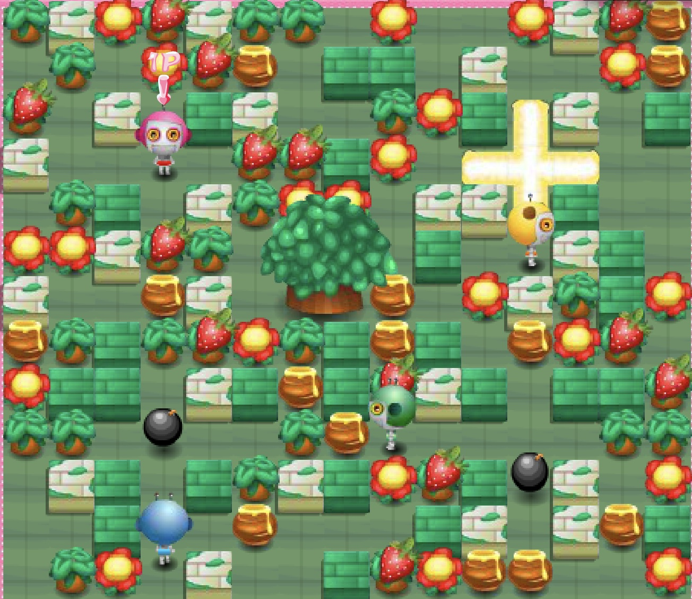
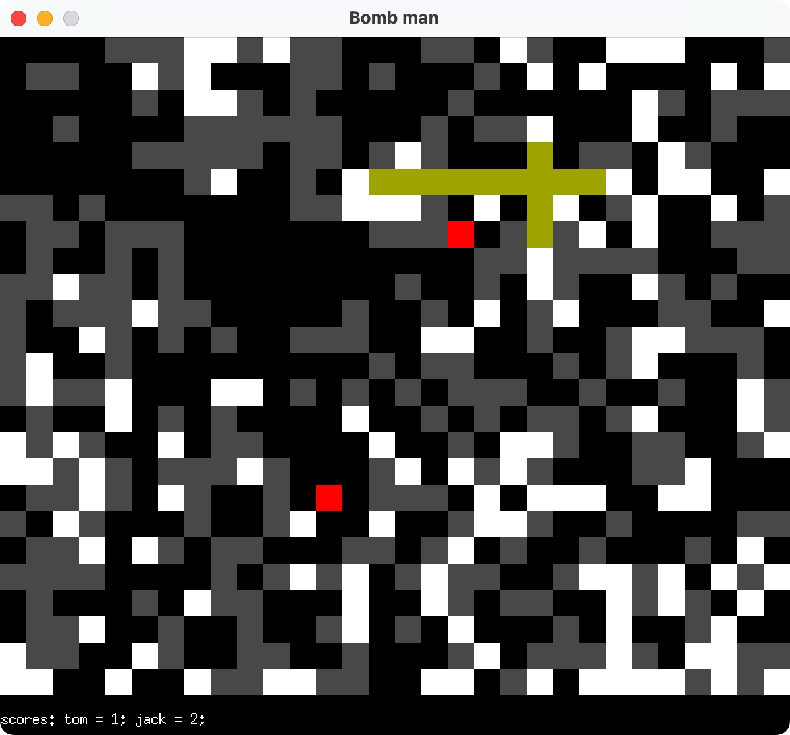
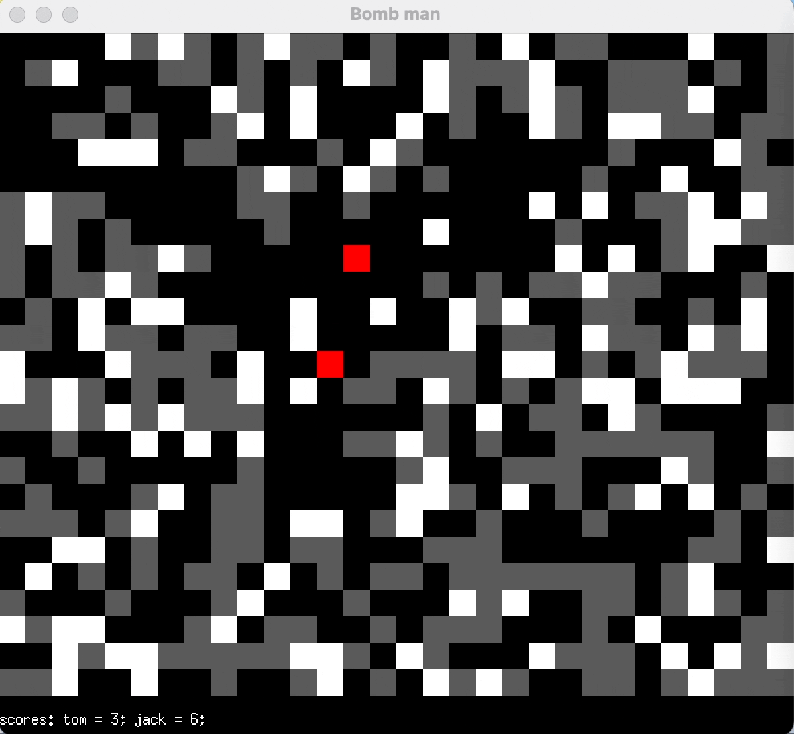
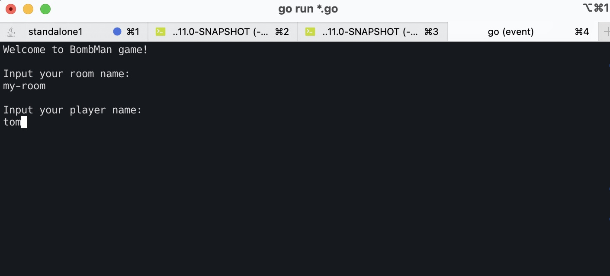
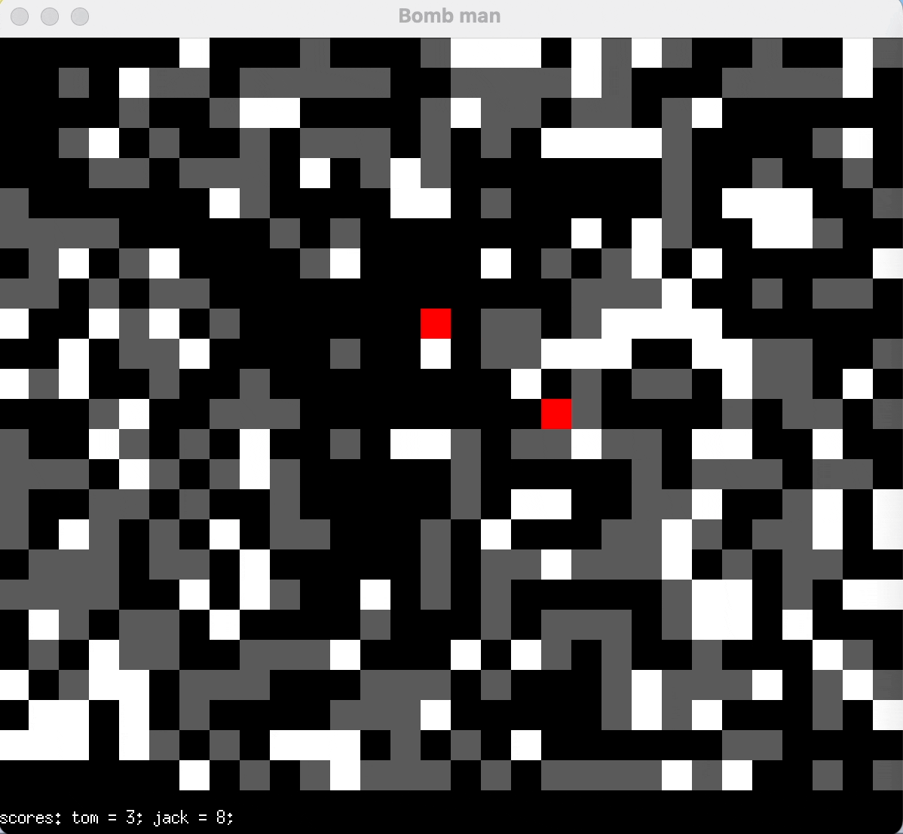
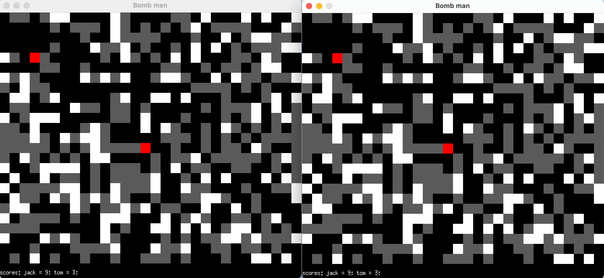
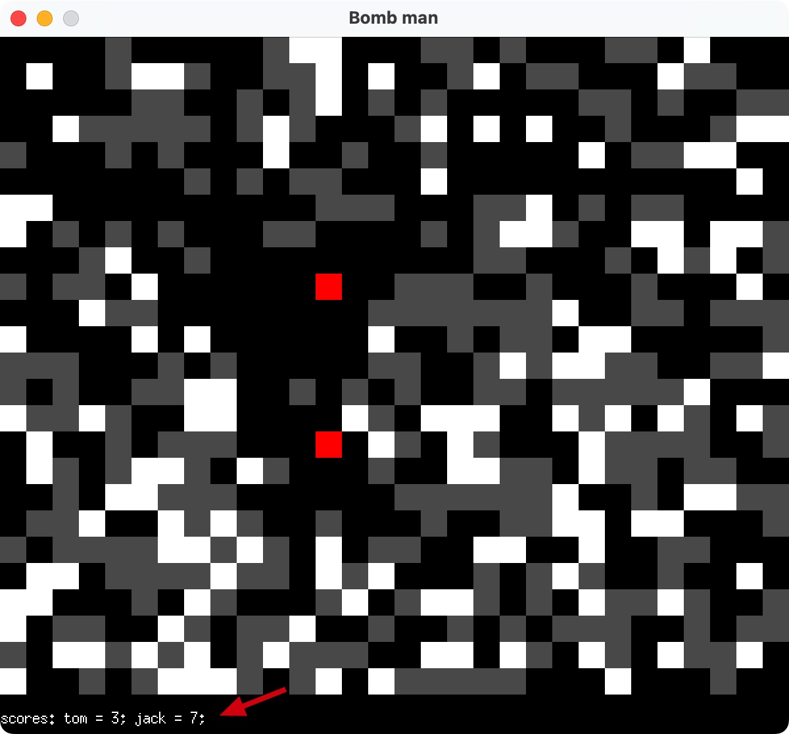
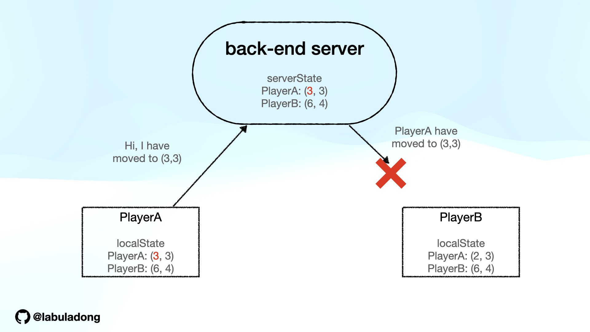
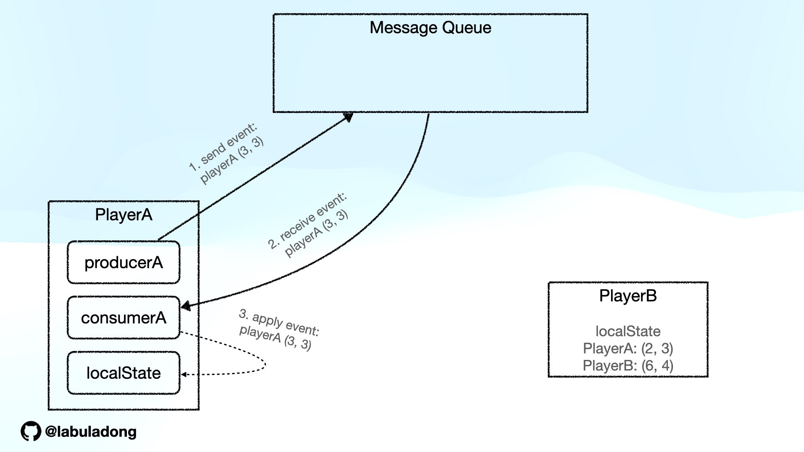

# Play with Apache Pulsar

目录：
 - [炸弹人游戏功能规划](./README.md)
 - [如何仅仅使用 Pulsar 完成所有游戏功能](./docs/用pulsar实现游戏需求.md)
 - [Golang 2D 游戏框架 Ebiten 实战](./docs/游戏框架简介.md)
 - [Apache Pulsar 的简介及部署](./docs/pulsar介绍及启动.md)
 - [Apache Pulsar Client 的常用 API 介绍](./docs/pulsar介绍及启动.md)
 - [如何使用 Pulsar 实现玩家间的同步]()
 - [Pulsar Schema 是什么？为什么要用 Schema？]()
 - [Pulsar Function 的开发、调试、部署]()
 - [利用 Pulsar table view 实现房间计分板]()
 - [利用 Pulsar connector 把数据导入 Redis]()
 - [利用 Offloader 卸载过期数据]()
 - [Pulsar 数据过期策略详解]()

我小时候特别喜欢在 4399 玩一款叫做 Q 版泡泡堂的游戏：



游戏里玩家可以操控一个机器人放炸弹，炸开障碍物能够获取随机道具，玩家消灭所有其他机器人则闯关成功，如果被其他机器人消灭，则闯关失败。

这个游戏中其他机器人都是电脑控制的，说实话有些蠢，我玩 Hard 难度一个小时就通关了。所以我在想，是否能够把这类炸弹人游戏做成多人在线的游戏，让几个好朋友联机 PK 呢？

这个教程的最终产物就是一个联机的多人在线小游戏：



## 游戏功能规划

经典的炸弹人游戏，每个玩家可以移动、放炸弹，炸弹在一段时间后会爆炸，被炸弹炸到的玩家会立即死亡，但允许玩家无限复活。



除了最基本的玩法，我们还有以下需求：

1、**需要「房间」的概念**，在相同房间里的玩家才能一起对战，不同房间之间不能互相影响。



2、为了提升游戏的操作难度和趣味性，允许玩家**推炸弹**。



4、地图中的障碍物是随机生成的，障碍物分为可摧毁的和不可摧毁的两种类型。考虑到可摧毁的障碍物会被玩家炸掉，我们需要给每个房间**定时更新新的地图**。



5、要有一个**房间计分板**，显示房间内每个玩家的得分情况。



6、除了当前游戏房间中的分数情况，我们还需要有一个**全局计分板**，可以对所有玩家在不同房间的总得分进行排名。

7、假设我们会举办重要赛事，需要支持游戏「录制」，以便**观看游戏回放**。

## 多人游戏的难点

我没有专门搞过多人在线游戏的开发，但是简单分析一下，我总结出来以下关键点：

**1、多人在线游戏肯定需要有一个后端服务供所有玩家连接**，但由于这只是个小游戏，所以希望开发尽可能简单，尽可能少写代码，避免重复造轮子。

**2、最重要的，所有玩家的操作必须同步，或者说要保证各个玩家视图的「一致性」**。

理想情况下，一个玩家做的操作能够通过量子纠缠瞬间同步到所有其他玩家那里，这样各个玩家的视图必然是一致的。

但实际情况是，每个玩家在本地的操作需要通过网络发送到游戏的服务端，然后服务端再通过网络同步给其他玩家。那么这里面多了两次网络通信，随便发生点意外就会破坏每个玩家的视图一致性。

比如就考虑两个玩家 `playerA` 和 `playerB`，他们分别站在 `(2, 3)` 和 `(6, 4)`，此时每个玩家的本地状态和服务端的状态都是一致的，这很好：


此时 `playerA` 进行一次移动，先更新本地状态，然后告诉服务端，服务端再通知到 `playerB`。但是服务端和 `playerB` 通信时出现了网络抖动导致通信失败，那么就造成了 `playerB` 的本地状态错误：



`playerB` 看到 `playerA` 仍然站在 `(2, 3)`，而实际上 `playerA` 已经站在了 `(3, 3)`。

此时如果 `playerB` 攻击 `(2, 3)`，他看见自己攻击了 `playerA`，但实际上 `playerA` 并没有受到攻击，这显然是一个非常严重的 bug。

你也许说，如果服务端和 `playerB` 通信失败，那就重试呗？

实际上也不好搞，因为要保证重试期间 `playerB` 不能有任何动作，否则 `playerB` 的本地状态本来就是错的，基于这个错误状态上的所有动作都会让问题更严重。

## 如何同步玩家

解法其实很简单，**我们的后端用一个消息队列就可以解决玩家间同步的问题**：

1、把所有玩家的操作抽象成一个事件。

2、在服务端有有一个全局一致的事件序列（消息队列）。

3、从一个相同的初始状态开始，执行一系列相同的事件，得到的结果总是相同。

满足了上述条件，所有玩家的本地客户端按顺序消费服务端的全局事件队列，就可以保证每个玩家的本地客户端状态一致了。

综上所述，我们的后端服务就是一个消息队列，客户端本地产生的事件也要先成功发送到消息队列，再从消息队列读取之后才会更新本地状态：



用一段伪码表示可能会更清晰：

```java
// 一个线程负责拉取并显示事件
new Thread(() -> {
    while (true) {
        // 不断从消息队列拉取事件
        Event event = consumer.receive();
        // 然后更新本地状态，显示给玩家
        updateLocalScreen(event);
    }
});

// 一个线程负责生成并发送本地事件
new Thread(() -> {
    while (true) {
        // 本地玩家产生的事件，要发送到消息队列
        Event localEvent = listenLocalKeyboard();
        producer.send(event);
    }
});
```

这样，所有玩家客户端都以后端消息队列中的事件顺序（全局一致）为准，依次消费这些事件更新本地状态，从而保证了所有客户端的本地状态全局强一致的。

> PS：回想一下，我们在玩 MOBA 游戏时，如果由于网络原因短暂卡顿重连，也会出现类似放快速放电影的情况。所以我猜测真实的多人在线游戏可能真的是通过类似消息队列的机制来保证玩家之间同步的。

下面我来具体讲讲如何使用 Apache Pulsar 这款消息队列来实现上面列举的游戏功能。

下一篇：[如何使用 Pulsar 完成游戏功能](./docs/用pulsar实现游戏需求.md)