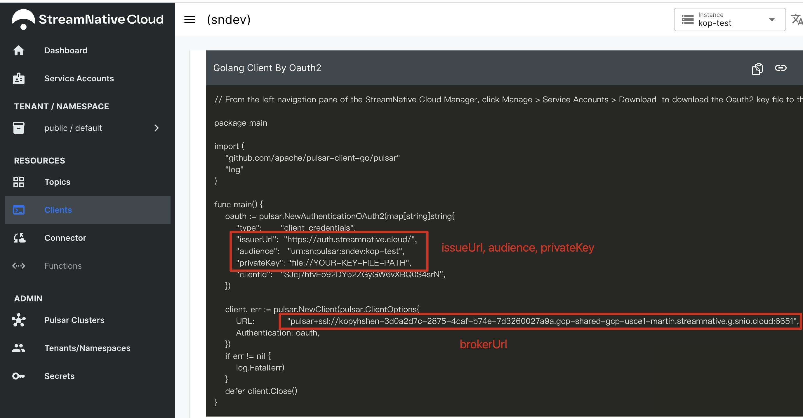

# pulsar-bomb-game

A tiny game using Apache Pulsar.

## How to install

1️⃣ Clone this repo, enter code folder.

```bash
git clone https://github.com/labuladong/play-with-pulsar.git
cd play-with-pulsar/game-code
```

2️⃣ Install the dependency:

```bash
go mod download
```

3️⃣ Change your private key path in `main.go`.

4️⃣ Compile to generate executable file `game`:

```bash
go build -o game *.go
```

## How to test locally

1️⃣ For test, you can start a standalone Pulsar cluster on `localhost:6650`:

```bash
bin/pulsar standalone
```

2️⃣ Run the executable file `game` with room name, player name and specify `play` mode:

```bash
./game -player jack -room roomname -mode play
```

By default, the game will try to connect `localhost:6650` to create a Pulsar client.

You can run several terminal window to simulate a multiplayer situation.

3️⃣ In addition, you can specify the `watch` mode to 'watch the battle' in a room:

```bash
./game -room testroom -mode watch -at earliest
```


## Play with others

There is a `config.yml` to specify how to connect to the Pulsar cluster.

For example, you can use OAuth2 to connect to StreamNative Cloud.

There is the configuration:

```yaml
brokerUrl: pulsar+ssl://kopyhshen-3d0a2d7c-2875-4caf-b74e-7d3260027a9a.gcp-shared-gcp-usce1-martin.streamnative.g.snio.cloud:6651

OAuth:
  enabled: true
  issuerUrl: https://auth.streamnative.cloud/
  audience: urn:sn:pulsar:sndev:kop-test
  privateKey: /Users/labuladong/Downloads/sndev-donglai-admin-test.json
```

You can get these config from StreamNative Cloud panel:



If you and your friends connect to the same Pulsar cluster and enter the same room, you can play together.